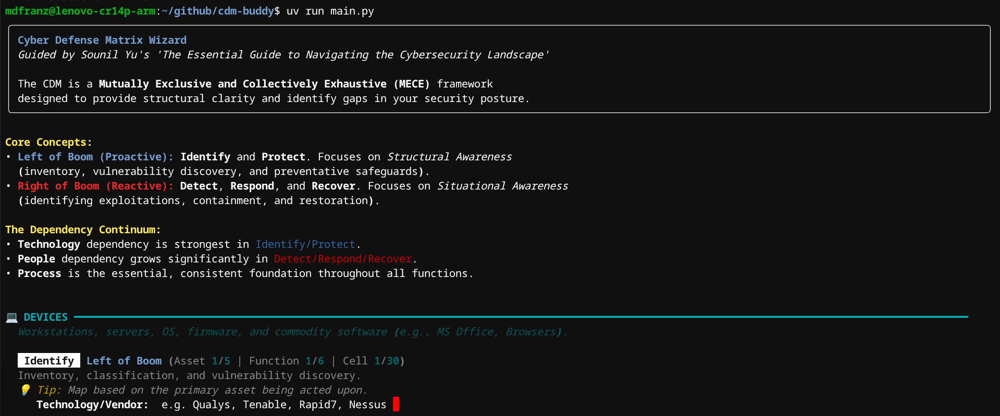

# Cyber Defense Matrix (CDM) Helper Monkey

An interactive CLI tool to map your security portfolio to Sounil Yu's Cyber Defense Matrix.


`NOTE`: This is a work in progress as I'm still trying to figure out how I'll use CDM.

## Features

- **Guided Mapping**: Interactive prompts with definitions for Asset Classes and NIST Functions.
- **CSF 2.0 Coverage**: Includes the `Govern` function alongside Identify, Protect, Detect, Respond, and Recover.
- **CDM Principles**: Built-in support for "Left/Right of Boom" and "Applications vs. Devices" logic.
- **Dependency Mapping**: Capture Technology, People, and Process for every control.
- **Excel Export**: Generates a styled report with visual cues for strategic analysis.

## Requirements

- [Go](https://go.dev/) 1.26.1+
- [Make](https://www.gnu.org/software/make/) (optional, for using the Makefile)

## Usage

### Run the Wizard

The easiest way to run the wizard is using `make`:

```bash
make run
```

Or using the Go CLI:

```bash
go run ./cmd/cdmbuddy
```




### Run Tests

To verify the exporter and data structure:

```bash
make test
```

Or:

```bash
go test -v ./...
```

## Source Code

See [GUIDE.md](GUIDE.md) and [WORKFLOW.md](WORKFLOW.md) for details on the project structure and CDM alignment.

## Credits & Acknowledgments

This tool is an unofficial companion to the **Cyber Defense Matrix (CDM)** created by **Sounil Yu**. 

- **Official Website**: [cyberdefensematrix.com](https://cyberdefensematrix.com/)
- **The Book**: [*Cyber Defense Matrix: The Essential Guide to Navigating the Cybersecurity Landscape*](https://www.amazon.com/Cyber-Defense-Matrix-Navigating-Cybersecurity/dp/B09QP2GSGZ/) by Sounil Yu.

I got inspired to write this after seeing a talk by [Stephen Dyson](https://www.linkedin.com/in/stephen-dyson-cybersecurity/) at [Bsides Charm 2026](https://www.bsidescharm.org/schedule/)

The CDM is a trademark of Sounil Yu. This project is not affiliated with, endorsed by, or sponsored by Sounil Yu or the Cyber Defense Matrix organization.
